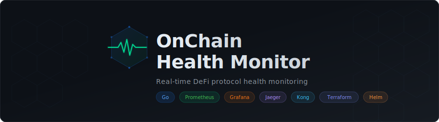
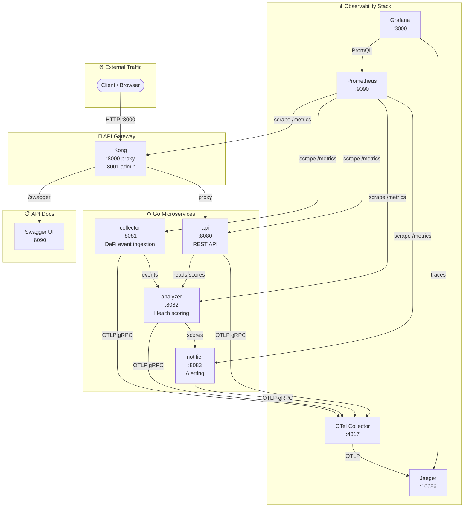
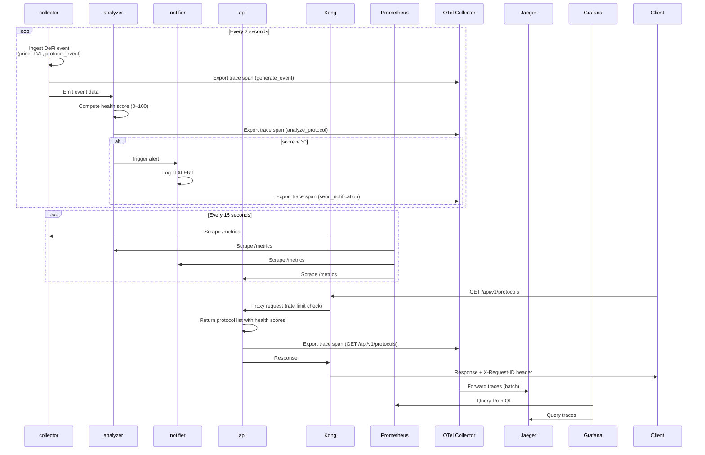
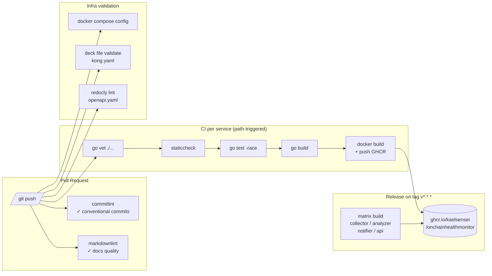

<p align="center">
  
</p>

<p align="center">
  <strong>Functionally simple. Architecturally serious.</strong>
</p>

[](https://golang.org)
[](LICENSE)

[](https://github.com/KaelSensei/OnChainHealthMonitor/actions/workflows/ci-api.yml)
[](https://github.com/KaelSensei/OnChainHealthMonitor/actions/workflows/ci-collector.yml)
[](https://github.com/KaelSensei/OnChainHealthMonitor/actions/workflows/ci-analyzer.yml)
[](https://github.com/KaelSensei/OnChainHealthMonitor/actions/workflows/ci-notifier.yml)

---

## Architecture



---

## Data Flow



---

## Services

| Service     | Port | Role                                                              |
|-------------|------|-------------------------------------------------------------------|
| `collector` | 8081 | Ingests on-chain data (mock mode: emits DeFi events every 2s)    |
| `analyzer`  | 8082 | Processes events, computes health scores (0–100) per protocol     |
| `notifier`  | 8083 | Fires alerts when any protocol score drops below threshold (30)   |
| `api`       | 8080 | REST API exposing protocol health data to external consumers      |

All services expose:
- `GET /health` → `{"status":"ok"}` for liveness checks
- `GET /metrics` → Prometheus text format

---

## Stack

| Theme                    | Tool                        | Why                                                      |
|--------------------------|-----------------------------|----------------------------------------------------------|
| Language                 | Go 1.22                     | Fast, minimal stdlib, perfect for microservices          |
| Containers               | Docker + Docker Compose     | Reproducible local environment, mirrors prod topology    |
| Observability: Metrics   | Prometheus + Grafana        | Industry standard; scrape model fits pull-based services |
| Observability: Tracing   | OpenTelemetry + OTel Collector + Jaeger | OTLP gRPC pipeline: services → collector → Jaeger UI |
| CI/CD                    | GitHub Actions              | Native to GitHub, path-based triggers for monorepos      |
| Reliability / Alerting   | Grafana Alerting            | Unified alerting with SLO-based rules, no extra infra    |
| API Gateway              | Kong (open-source)          | Plugin ecosystem (rate limit, auth, logging) on OSS      |
| Infra as Code            | Terraform                   | Declarative, provider-agnostic, auditable history        |
| Kubernetes packaging     | Helm                        | Templated manifests, per-environment value overrides     |
| Cloud                    | GCP / GKE (or k3s locally)  | k3s for zero-cost dev; GKE for real deployment           |

---

## Production Deployment (GKE)

See [Infrastructure Guide](docs/deployment/INFRASTRUCTURE_GUIDE.md) for full details.

**Quick summary:**
1. Provision GKE: `cd infra/terraform && terraform apply`
2. Deploy with Helm: `helm install onchain-health-monitor ./infra/helm/onchain-health-monitor -n onchain-health-monitor --create-namespace`
3. Check status: `kubectl get pods -n onchain-health-monitor`

---

## Quick Start

```bash
# Clone
git clone https://github.com/KaelSensei/OnChainHealthMonitor.git
cd OnChainHealthMonitor

# Start the full stack (builds all 4 services + spins up Prometheus, Grafana, Jaeger)
docker-compose up --build

# In another terminal, verify services
curl http://localhost:8080/health           # API
curl http://localhost:8080/api/v1/protocols # Protocol list
curl http://localhost:8081/health           # Collector
curl http://localhost:8082/health           # Analyzer
curl http://localhost:8083/health           # Notifier

# Observability UIs
open http://localhost:9090   # Prometheus
open http://localhost:3000   # Grafana  (admin / admin)
open http://localhost:16686  # Jaeger - distributed trace UI
open http://localhost:55679  # OTel Collector zpages - debug pipeline stats
open http://localhost:8090/swagger  # Swagger UI - interactive API docs
open http://localhost:8000/swagger  # Swagger UI via Kong gateway
```

### API Examples

```bash
# List all monitored protocols
curl http://localhost:8080/api/v1/protocols

# Get a single protocol
curl http://localhost:8080/api/v1/protocols/uniswap
curl http://localhost:8080/api/v1/protocols/aave
curl http://localhost:8080/api/v1/protocols/compound
```

---

## Mock Mode vs Real Data

The `collector` service runs in **mock mode by default** - it generates realistic synthetic DeFi data without requiring external connections, so the full pipeline works out of the box.

Switching to real on-chain data is a config change, not a code change:

```bash
MOCK_MODE=false
RPC_ENDPOINT=https://mainnet.infura.io/v3/<YOUR_KEY>
```

---

## Decision Log

### Why Go?
Minimal external dependencies, single static binary, excellent stdlib HTTP server - ideal for writing observable microservices without framework overhead. Each service compiles to a ~5MB binary.

### Why Prometheus + Grafana over Datadog?
Open-source, self-hosted, zero cost. Pull-based scraping matches the `/metrics` endpoints natively. Grafana Alerting provides SLO-based rules without a separate tool.

### Why Jaeger?
Native OTLP receiver, lightweight all-in-one Docker image, clean UI. OpenTelemetry SDK is vendor-neutral - swapping Jaeger for Honeycomb or Tempo is a config change.

### Why GitHub Actions?
The repo lives on GitHub. Native integration means no extra webhook setup, and path-based triggers (`on: push: paths:`) enable proper monorepo CI - only the changed service gets rebuilt.

### Why Kong?
Open-source, plugin-based, battle-tested at scale. Rate limiting, authentication, and request logging are single-line plugin configurations - no custom middleware code needed.

### Why Terraform?
Declarative, provider-agnostic, and produces an auditable state file. Infrastructure changes are reviewed in PRs the same way code changes are - nothing is clicked manually.

### Why Helm?
Kubernetes manifests need per-environment value overrides (image tag, replica count, resource limits). Helm templates are the standard way to manage that across staging/production without duplicating YAML.

---

## Project Structure

```
OnChainHealthMonitor/
├── services/
│   ├── collector/     # DeFi event ingestion + HTTP server
│   ├── analyzer/      # Health score computation
│   ├── notifier/      # Alert engine
│   └── api/           # Public REST API
├── infra/
│   ├── terraform/     # GCP/GKE infrastructure as code
│   ├── helm/          # Helm charts per service
│   └── k8s/           # Raw Kubernetes manifests
├── observability/
│   ├── prometheus/    # Scrape configuration
│   ├── grafana/       # Dashboard definitions
│   ├── otel/          # OpenTelemetry collector config
│   └── jaeger/        # Jaeger configuration
├── docs/
│   ├── architecture/  # ARCHITECTURE.md + ADRs
│   ├── deployment/    # Infrastructure & CI/CD guides
│   └── development/   # Onboarding guide
├── .github/
│   └── workflows/     # GitHub Actions pipelines
├── docker-compose.yml
└── README.md
```

---

## CI/CD Pipeline



---

## Documentation

| Document | Description |
|----------|-------------|
| [ROADMAP.md](./ROADMAP.md) | Project roadmap - completed milestones and upcoming work |
| [Architecture](./docs/architecture/ARCHITECTURE.md) | System overview, service responsibilities, data flow, environment variables |
| [Architecture Decisions (ADRs)](./docs/architecture/DECISIONS.md) | Why each tool was chosen: Go, Prometheus, Grafana, OTel, Jaeger, Kong, Terraform, Helm |
| [Getting Started](./docs/development/GETTING_STARTED.md) | Developer onboarding: prerequisites, first run, service ports, curl examples |
| [Tracing Guide](./docs/development/TRACING_GUIDE.md) | How to view traces in Jaeger, use zpages, and add spans to service code |
| [Local Setup](./docs/deployment/LOCAL_SETUP.md) | Full docker-compose setup, troubleshooting, reset procedures |
| [Contributing](./docs/development/CONTRIBUTING.md) | Branch naming, conventional commits, how to add a service or metric, code style |
| [CI/CD Guide](./docs/deployment/CI_CD_GUIDE.md) | GitHub Actions pipeline: workflows, path triggers, GHCR, releases, PR checks |
| [Infrastructure Guide](./docs/deployment/INFRASTRUCTURE_GUIDE.md) | Terraform, Helm, and Kubernetes - provisioning GKE and deploying all services |
| [Project Brief](./docs/architecture/PROJECT_BRIEF.md) | Project scope, motivation, and tool selection rationale |
| [Runbooks](./docs/runbooks/README.md) | Operational runbooks for each Grafana alert - what to do when an alert fires |

---

## License

MIT © KaelSensei
