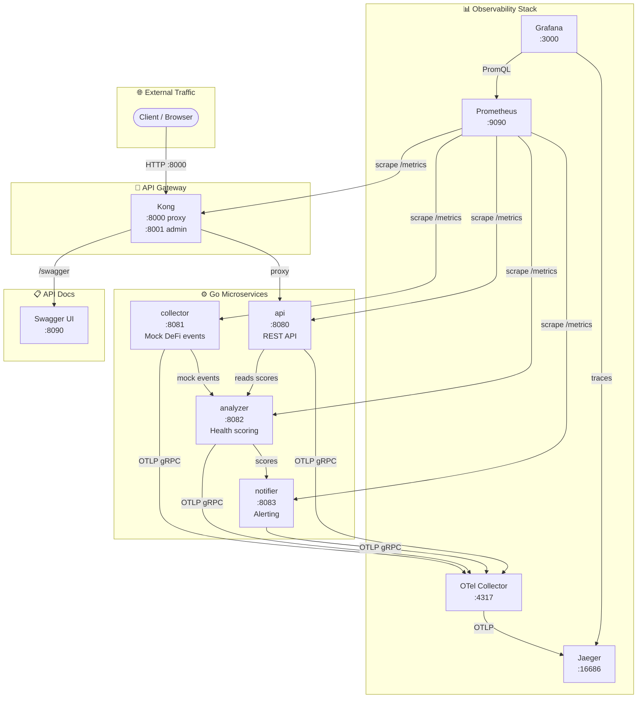
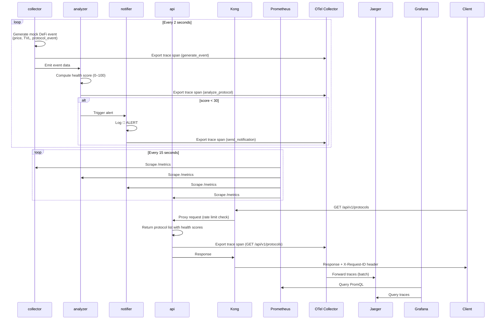

# Architecture - OnChain Health Monitor

## System Overview

OnChain Health Monitor is a monorepo housing four Go microservices that together form a continuous on-chain DeFi monitoring pipeline. The system ingests mock DeFi events (or real blockchain data via RPC), computes protocol health scores, triggers alerts on degradation, and exposes the results through a REST API. An observability stack (Prometheus, Grafana, Jaeger) runs alongside the application services.

The design philosophy: **functionally simple, architecturally serious.** The domain logic is intentionally shallow so that the infrastructure patterns - distributed tracing, metrics, containerisation, API gateway, IaC - are the real focus.

---

## Service Interaction Diagram



---

## Data Flow

### Phase 1 (current) - Mock pipeline



> **Note:** In Phase 1, inter-service communication is simulated in-process (each service maintains its own state). Real cross-service calls (HTTP or message queue) are planned for Phase 2.

### Future (Phase 2+) - Real pipeline

```
Collector  →  (RPC_ENDPOINT + MOCK_MODE=false)  →  real blockchain events
           →  publishes to internal HTTP or message queue
Analyzer   →  consumes events from Collector HTTP endpoint
           →  propagates OpenTelemetry trace context across service boundaries
Notifier   →  subscribes to Analyzer health score updates
API        →  reads from Analyzer (or shared store)
```

---

## Services

### `collector` - Event Ingestion

| Property | Value |
|----------|-------|
| Port | `8081` |
| Role | Ingests DeFi protocol data; in mock mode, emits fake events |
| Inputs | None in mock mode; RPC endpoint in real mode |
| Outputs | JSON event log to stdout; current state on `/metrics` |

**Endpoints:**

| Method | Path | Description |
|--------|------|-------------|
| `GET` | `/health` | Liveness check → `{"status":"ok"}` |
| `GET` | `/metrics` | Prometheus gauges: `collector_price_usd`, `collector_tvl_usd` |

**Mock mode behaviour:**
- Runs a goroutine (`emitLoop`) that ticks every 2 seconds
- For each of 3 protocols (Uniswap, Aave, Compound), generates a `DeFiEvent` with:
  - Price: random walk ±2% per tick, clamped to ±20% of baseline
  - TVL: random walk ±1% per tick, clamped to ±20% of baseline
  - Event type: one of `price_update`, `tvl_change`, `swap`, `liquidation`, `deposit`
  - Volume: 1–5% of current TVL
- Events are JSON-encoded to `log.Writer()` (stdout)

**Baseline values:**

| Protocol | Price (USD) | TVL (USD) |
|----------|------------|-----------|
| Uniswap | $6.50 | $4.2B |
| Aave | $95.00 | $6.1B |
| Compound | $52.00 | $2.3B |

---

### `analyzer` - Health Score Computation

| Property | Value |
|----------|-------|
| Port | `8082` |
| Role | Computes a health score (0–100) per protocol |
| Inputs | Protocol state (simulated in Phase 1; Collector events in Phase 2) |
| Outputs | Health scores on `/metrics`; will feed API and Notifier |

**Endpoints:**

| Method | Path | Description |
|--------|------|-------------|
| `GET` | `/health` | Liveness check → `{"status":"ok"}` |
| `GET` | `/metrics` | Prometheus gauge: `analyzer_health_score{protocol="..."}` |

**Score labels:**

| Score range | Label |
|-------------|-------|
| 70–100 | `healthy` |
| 40–69 | `degraded` |
| 0–39 | `critical` |

**Simulation:** `analyzeLoop` runs every 3 seconds, applying a random delta of ±5 to each protocol's score, clamped to [0, 100].

---

### `notifier` - Alert Engine

| Property | Value |
|----------|-------|
| Port | `8083` |
| Role | Fires alerts when a protocol's health score drops below threshold |
| Inputs | Simulated health scores (mirrors Analyzer logic in Phase 1) |
| Outputs | Alert log to stdout; `notifier_alerts_total` counter on `/metrics` |

**Endpoints:**

| Method | Path | Description |
|--------|------|-------------|
| `GET` | `/health` | Liveness check → `{"status":"ok"}` |
| `GET` | `/metrics` | Prometheus counter: `notifier_alerts_total` |

**Alert logic:**
- `alertLoop` runs every 5 seconds
- Critical threshold: `score < 30`
- Severity levels: `WARNING` (score 20–29), `CRITICAL` (score < 20)
- Compound is biased lower (base score 35) to produce visible alerts during demos
- Future: real integrations with PagerDuty, Slack, or Grafana Alerting webhooks

---

### `api` - Public REST API

| Property | Value |
|----------|-------|
| Port | `8080` |
| Role | Exposes protocol health data to external consumers |
| Inputs | In-memory protocol state (will read from Analyzer in Phase 2) |
| Outputs | JSON REST responses |

**Endpoints:**

| Method | Path | Description |
|--------|------|-------------|
| `GET` | `/health` | Liveness check → `{"status":"ok"}` |
| `GET` | `/metrics` | Prometheus counter: `api_requests_total` |
| `GET` | `/api/v1/protocols` | List all protocols with health scores |
| `GET` | `/api/v1/protocols/{id}` | Get a single protocol by ID |

**Protocol response schema:**

```json
{
  "id": "string",
  "name": "string",
  "category": "string (DEX | Lending)",
  "chain": "string",
  "health_score": "integer (0–100)",
  "status": "string (healthy | degraded | critical)",
  "tvl_usd": "float",
  "price_usd": "float",
  "updated_at": "ISO 8601 timestamp"
}
```

**List response schema:**
```json
{
  "protocols": [...],
  "total": "integer"
}
```

**Error response:**
```json
{"error": "protocol \"unknown\" not found"}
```
HTTP 404 for unknown protocol IDs.

---

## Observability Stack

### Metrics - Prometheus + Grafana

```
Each service exposes GET /metrics (Prometheus text format, content-type: text/plain; version=0.0.4)
          │
          │ scrape every 10s (per-service jobs in prometheus.yml)
          ▼
    Prometheus :9090
          │
          │ data source
          ▼
    Grafana :3000
          │
          │ dashboards (Phase 2: latency, error rate, health scores, alert counts)
          ▼
    Grafana Alerting (Phase 2: SLO rules → webhook → notification channels)
```

**Current metrics exposed:**

| Service | Metric | Type | Description |
|---------|--------|------|-------------|
| collector | `collector_price_usd{protocol}` | Gauge | Current price in USD |
| collector | `collector_tvl_usd{protocol}` | Gauge | Current TVL in USD |
| analyzer | `analyzer_health_score{protocol}` | Gauge | Current health score (0–100) |
| notifier | `notifier_alerts_total` | Counter | Total alerts fired since startup |
| api | `api_requests_total` | Counter | Total HTTP requests handled |

**Prometheus scrape config:** `observability/prometheus/prometheus.yml`  
Scrape interval: 10s per service, 15s global.

### Traces - OpenTelemetry + Jaeger

#### Distributed Tracing

All four Go services are instrumented with the OpenTelemetry Go SDK. Each service initialises an OTLP gRPC exporter at startup, pointing at the OTel Collector (`otel-collector:4317`). If the collector is unreachable, the service logs a warning and continues running without tracing (graceful degradation).

**Trace pipeline:**

```
Go service (OTLP gRPC) → otel-collector:4317 → batch processor → jaeger:4317 → Jaeger UI (:16686)
```

The OTel Collector is configured in `observability/otel/otel-collector-config.yaml`:
- **Receiver:** OTLP (gRPC on `:4317`, HTTP on `:4318`)
- **Processor:** batch (1s timeout, 1024 spans/batch)
- **Exporter:** `otlp/jaeger` (forwards to Jaeger) + `logging` (prints spans to collector logs for debugging)
- **zpages debug UI:** `http://localhost:55679`

**Spans currently instrumented:**

| Service | Span | Attributes |
|---------|------|-----------|
| `collector` | `generate_event` | `protocol.id`, `event.type`, `price.usd`, `tvl.usd` |
| `analyzer` | `analyze_protocol` | `protocol.id`, `health.score`, `health.label` |

Jaeger is auto-provisioned as a Grafana datasource, so you can correlate traces directly from Grafana dashboards.

See `docs/development/TRACING_GUIDE.md` for how to search traces in the Jaeger UI and how to add spans to new service code.

---

## Mock Mode

The `collector` service runs in **mock mode by default** - it generates realistic but synthetic DeFi data internally without requiring any external connections. This means:

- The full 4-service pipeline runs end-to-end from `docker compose up`
- Grafana dashboards and alerts are populated with live-looking data immediately
- No API keys, no blockchain RPC quotas, no rate-limiting issues during development

**Switching to real data** (planned Phase 2):
```bash
MOCK_MODE=false
RPC_ENDPOINT=https://mainnet.infura.io/v3/<KEY>
```
This is a configuration change, not a code change.

---

## Docker Compose Network Layout

All containers share a default bridge network created by Docker Compose. Service discovery uses Docker's built-in DNS - containers reference each other by service name (e.g., `prometheus` scrapes `http://collector:8081/metrics`).

```
Docker bridge network: onchain_network
  ├── collector      (onchain_collector)       :8081 → host:8081
  ├── analyzer       (onchain_analyzer)        :8082 → host:8082
  ├── notifier       (onchain_notifier)        :8083 → host:8083
  ├── api            (onchain_api)             :8080 → host:8080
  ├── prometheus     (onchain_prometheus)      :9090 → host:9090
  ├── grafana        (onchain_grafana)         :3000 → host:3000
  ├── jaeger         (onchain_jaeger)          :16686 (UI) / :4317 (gRPC fallback) → host
  └── otel-collector (onchain_otel_collector)  :4317 (gRPC) / :4318 (HTTP) / :55679 (zpages) → host
```

**Note:** Services export traces to `otel-collector:4317` (internal Docker DNS). The otel-collector container is not exposed on host port 4317 - that port is mapped to Jaeger instead (for direct OTLP fallback). The zpages debug interface (`localhost:55679`) is the primary way to verify the collector is receiving spans.

**Volumes:**
- `grafana_data` - persists Grafana state (dashboards, users) across restarts

**Startup dependencies (Docker Compose `depends_on`):**
- `analyzer` depends on `collector`
- `notifier` depends on `analyzer`
- `api` depends on `analyzer`
- `grafana` depends on `prometheus`

---

## Environment Variables Reference

### `collector`

| Variable | Default | Description |
|----------|---------|-------------|
| `MOCK_MODE` | `true` | Set `false` to connect to a real RPC endpoint |
| `RPC_ENDPOINT` | _(none)_ | Blockchain RPC URL (used when `MOCK_MODE=false`) |
| `EMIT_INTERVAL_MS` | `2000` | Milliseconds between mock event emission cycles |
| `PORT` | `8081` | HTTP server port |
| `LOG_LEVEL` | `info` | Logging verbosity |
| `OTEL_EXPORTER_OTLP_ENDPOINT` | `otel-collector:4317` | OTLP gRPC endpoint for trace export (set in docker-compose) |

### `analyzer`

| Variable | Default | Description |
|----------|---------|-------------|
| `COLLECTOR_URL` | `http://collector:8081` | Base URL of the collector service |
| `ANALYZE_INTERVAL_MS` | `3000` | Milliseconds between analysis cycles |
| `PORT` | `8082` | HTTP server port |
| `LOG_LEVEL` | `info` | Logging verbosity |
| `OTEL_EXPORTER_OTLP_ENDPOINT` | `otel-collector:4317` | OTLP gRPC endpoint for trace export (set in docker-compose) |

### `notifier`

| Variable | Default | Description |
|----------|---------|-------------|
| `ANALYZER_URL` | `http://analyzer:8082` | Base URL of the analyzer service |
| `ALERT_THRESHOLD` | `30` | Score below which an alert fires |
| `POLL_INTERVAL_MS` | `5000` | Milliseconds between alert checks |
| `PORT` | `8083` | HTTP server port |
| `WEBHOOK_URL` | _(none)_ | Optional: Slack/PagerDuty webhook for real notifications |
| `OTEL_EXPORTER_OTLP_ENDPOINT` | `otel-collector:4317` | OTLP gRPC endpoint for trace export (set in docker-compose) |

### `api`

| Variable | Default | Description |
|----------|---------|-------------|
| `ANALYZER_URL` | `http://analyzer:8082` | Base URL of the analyzer service |
| `PORT` | `8080` | HTTP server port |
| `LOG_LEVEL` | `info` | Logging verbosity |
| `OTEL_EXPORTER_OTLP_ENDPOINT` | `otel-collector:4317` | OTLP gRPC endpoint for trace export (set in docker-compose) |

> **Note:** `OTEL_EXPORTER_OTLP_ENDPOINT` is set for all four services in `docker-compose.yml`. Other variables are compiled in as defaults for Phase 1; runtime override support is planned for Phase 2.

---

## Repository Structure

```
OnChainHealthMonitor/
├── services/
│   ├── collector/          # Mock DeFi event generator
│   │   ├── main.go
│   │   ├── go.mod
│   │   └── Dockerfile
│   ├── analyzer/           # Health score computation
│   │   ├── main.go
│   │   ├── go.mod
│   │   └── Dockerfile
│   ├── notifier/           # Alert engine
│   │   ├── main.go
│   │   ├── go.mod
│   │   └── Dockerfile
│   └── api/                # Public REST API
│       ├── main.go
│       ├── go.mod
│       └── Dockerfile
├── infra/
│   ├── terraform/          # GCP/GKE infrastructure (Phase 5)
│   ├── helm/               # Helm charts per service (Phase 5)
│   └── k8s/                # Raw Kubernetes manifests (Phase 5)
├── observability/
│   ├── prometheus/
│   │   └── prometheus.yml  # Scrape configuration
│   ├── grafana/
│   │   └── dashboards/     # Dashboard JSON definitions (Phase 2)
│   ├── otel/               # OpenTelemetry collector config (Phase 2)
│   └── jaeger/             # Jaeger configuration (Phase 2)
├── docs/
│   ├── architecture/
│   │   ├── PROJECT_BRIEF.md
│   │   ├── ARCHITECTURE.md  ← this file
│   │   └── DECISIONS.md
│   ├── deployment/
│   │   └── LOCAL_SETUP.md
│   └── development/
│       ├── GETTING_STARTED.md
│       └── CONTRIBUTING.md
├── .github/
│   └── workflows/           # GitHub Actions pipelines (Phase 4)
├── docker-compose.yml
├── ROADMAP.md
└── README.md
```
